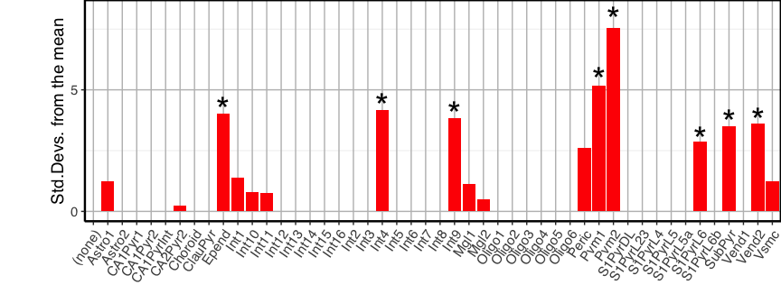
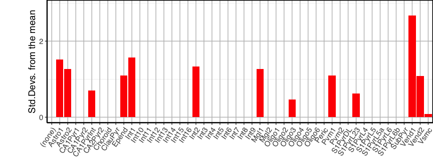
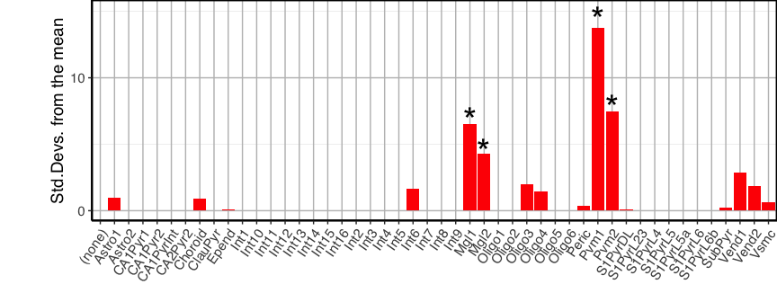
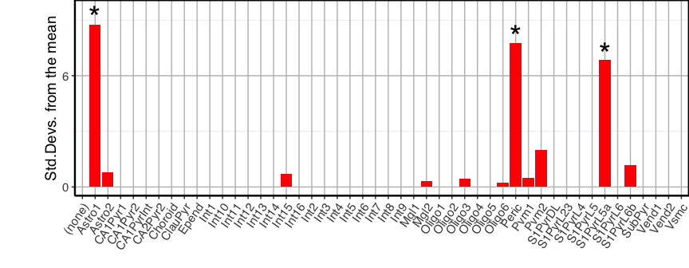

One2one Orthologs
================
Nathan Skene
2018-01-17

This package is used to get 1:1 orthologs based on MGI homology data from <http://www.informatics.jax.org/homology.shtml>

The data is processed within the package but for key species comparisons is also stored in the data

Get the homolog data
--------------------

``` r
library(One2One)

# Download and format the homolog data from MGI
allHomologs = load.homologs()
```

    ## [1] "Species for which homology classes are available:"
    ##  [1] "mouse, laboratory"    "human"                "chimpanzee"          
    ##  [4] "macaque, rhesus"      "dog, domestic"        "cattle"              
    ##  [7] "rat"                  "frog, western clawed" "zebrafish"           
    ## [10] "chicken"

``` r
# Get data on orthology between the two species
species1="human"
species2="mouse"
ortholog_data = analyse.orthology(species1,species2,allHomologs)
```

    ## [1] "Selected species: human"
    ## [1] "Selected species: mouse, laboratory"
    ## [1] "Full dataset contains 18708 genes from human"
    ## [1] "Full dataset contains 18995 genes from mouse"
    ## [1] "1954 genes which are present in human are deleted in mouse"
    ## [1] "2241 genes which are present in mouse are deleted in human"
    ## [1] "220 genes are duplicated in human"
    ## [1] "609 genes are duplicated in mouse"
    ## [1] "16470 are shared 1:1 between the two species"

``` r
# Check the 1:1 homologs
print(ortholog_data$orthologs_one2one[1:10,])
```

    ##    HomoloGene ID human.symbol mouse.symbol
    ## 1            100         ETFA         Etfa
    ## 2           1000        CLDN4        Cldn4
    ## 3          10001        HAUS2        Haus2
    ## 4          10003        EFHC1        Efhc1
    ## 5          10004       LRRC8D       Lrrc8d
    ## 6          10005        THAP1        Thap1
    ## 7         100054         DGKD         Dgkd
    ## 8          10006       ZDHHC4       Zdhhc4
    ## 9         100071         ANO5         Ano5
    ## 10        100077       UBALD2       Ubald2

Analyse differences in orthology using EWCE
-------------------------------------------

``` r
# Load EWCE package
#install.packages("devtools")
#library(devtools)
#install_github("nathanskene/ewce")
library(EWCE)
data(ctd)


homoIDs_bg     = ortholog_data$species2_allGenes
symbols_bg     = get.symbol.from.homologID(homoIDs_bg,species1,species2,ortholog_data,species2)

# Which cell types are associated with genes deleted in humans, but present in mice?
homoIDs_target = ortholog_data$species2_present_species1_deleted
symbols_target = get.symbol.from.homologID(homoIDs_target,species1,species2,ortholog_data,species2)
full_results = bootstrap.enrichment.test(sct_data=ctd,hits=symbols_target,bg=symbols_bg,reps=1000,annotLevel=2)
```

    ##   [1] "Zc3h15"        "Spin2c"        "Gm13023"       "4933415F23Rik"
    ##   [5] "Larp1b"        "Dcpp2"         "Dcpp3"         "Vmn2r54"      
    ##   [9] "Cbr2"          "Cntnap5b"      "Tomm5"         "9030025P20Rik"
    ##  [13] "Gm10267"       "Zfp955a"       "Zfp955b"       "Rpl34-ps1"    
    ##  [17] "Rpl34"         "Trim43b"       "2410002F23Rik" "Nptn"         
    ##  [21] "Mcts2"         "Olfr117"       "Skint7"        "Dbil5"        
    ##  [25] "Doc2g"         "Rpl23a"        "Olfr944"       "Oas1c"        
    ##  [29] "Oas1d"         "Klra5"         "Vmn1r195"      "Psg23"        
    ##  [33] "Ccdc71"        "Bmyc"          "Naip5"         "Vmn2r29"      
    ##  [37] "Ly6a"          "Ly6c1"         "Ly6c2"         "Ly6f"         
    ##  [41] "Car15"         "Trim30a"       "Trim30d"       "Cd209f"       
    ##  [45] "Vmn2r71"       "Gimap9"        "Gm3696"        "Gm10406"      
    ##  [49] "Gm3558"        "Gm5796"        "Ccnjl"         "Serpina3g"    
    ##  [53] "Tmsb10"        "Tmsb15l"       "Tmsb4x"        "Calm1"        
    ##  [57] "Calm2"         "Calm3"         "Mettl7a2"      "Mettl7a3"     
    ##  [61] "Fcna"          "Gstm6"         "Zfp93"         "Zfp108"       
    ##  [65] "Zfp747"        "Map3k7"        "Akr1c13"       "Prorsd1"      
    ##  [69] "Josd1"         "Ccdc163"       "Tstd3"         "Lrrc9"        
    ##  [73] "BC051142"      "Sult1a1"       "Ms4a6b"        "Adam6b"       
    ##  [77] "Oasl2"         "Akr1b10"       "Npcd"          "B020004C17Rik"
    ##  [81] "Nebl"          "Fam187a"       "Aldoart1"      "Msl3l2"       
    ##  [85] "Zfp956"        "4430402I18Rik" "Hmgn2"         "Tpm1"         
    ##  [89] "Ppp2r5c"       "Zkscan4"       "Smok3b"        "Zfp952"       
    ##  [93] "Cntnap5c"      "Celf6"         "Zfp740"        "Sult5a1"      
    ##  [97] "2900026A02Rik" "Zfp958"        "Vmn2r13"       "Vmn2r87"      
    ## [101] "Vmn2r61"       "Srp54c"        "Cyp4f17"       "Gramd1c"      
    ## [105] "Vmn2r2"        "Lage3"         "Zfp954"        "Zim1"         
    ## [109] "Ankrd50"       "Smim11"        "Zfp949"        "Tgtp1"        
    ## [113] "Znrd1as"       "Fam193b"       "Zeb2os"        "Gm4858"       
    ## [117] "Bmp8b"         "Ctla2a"        "Ctla2b"        "Klrc3"        
    ## [121] "Mcpt4"         "Pdzph1"        "Ms4a6c"        "4930519F16Rik"
    ## [125] "9430038I01Rik" "Cox7b2"        "Slco1a4"       "Foxp1"        
    ## [129] "Abca8a"        "Snhg11"        "Tmem191c"      "Spink10"      
    ## [133] "Nr1h5"         "Tlr13"         "1700023F06Rik" "Zfp35"        
    ## [137] "Arxes1"        "Arxes2"        "Gm14295"       "Cyp2j12"      
    ## [141] "Slfn2"         "Zfp945"        "Zfp944"        "Zfp942"       
    ## [145] "Zfp994"        "Zfp947"        "Zfp995"        "1810037I17Rik"
    ## [149] "0610009B22Rik" "Aldh3b3"       "1700011I03Rik" "Snrpa"        
    ## [153] "Olfr695"       "Olfr945"       "Zfp85"         "BC048507"     
    ## [157] "Spag6"         "Cox5b"         "Hspa1b"        "Rnf113a1"     
    ## [161] "Sf3a2"         "Srsf5"         "Otud5"         "Rpl36"        
    ## [165] "Zfp960"        "Zfp97"         "Rsrc2"         "Crip2"        
    ## [169] "Gstt3"         "Ccl7"          "Qars"          "Prr13"        
    ## [173] "Zfp658"        "U2af1l4"       "Spink2"        "Plpp1"        
    ## [177] "Cox6c"         "Sf1"           "Olfr1331"      "Irgm1"        
    ## [181] "Fus"           "Zfp708"        "Celf1"         "Nxpe5"        
    ## [185] "Maml2"         "Aldoart2"      "Alg13"         "Plscr2"       
    ## [189] "Supt20"        "Abi3bp"        "Afg3l1"        "Snrpc"        
    ## [193] "Hmgb3"         "Clasrp"        "Tpm2"          "Zfp873"       
    ## [197] "Sct"           "Dmrtc1a"       "Zfp943"        "Cfhr2"        
    ## [201] "Crb3"          "Foxp2"         "Vma21"         "Dazap1"       
    ## [205] "Prrt1"         "Smim26"        "Gm1673"        "AW146154"     
    ## [209] "Cdkn1c"        "9130409I23Rik" "Rbx1"          "Nedd4"        
    ## [213] "Mptx2"         "Mapre2"        "Zfp748"        "Akap9"        
    ## [217] "Nxf7"          "Ifi27"         "Hnrnpa1"       "Rbfox3"       
    ## [221] "Ewsr1"         "Evi5l"         "Fnbp1l"        "Setd1b"       
    ## [225] "Rpl22l1"       "Gstt1"         "Gk"            "Aph1c"        
    ## [229] "Uba52"         "Tmem115"       "Rasl2-9"       "Ppp1cc"       
    ## [233] "Zfp874a"       "Zfp874b"       "Gsta4"         "Fmnl1"        
    ## [237] "Nrbp2"         "Kcnn2"         "Rcor3"         "Ppp1r12b"     
    ## [241] "Mamld1"        "Nacad"         "Pcmt1"         "Plekha6"      
    ## [245] "Hmgb1"         "Cyp4f16"       "Fam13a"        "Zfp938"       
    ## [249] "Eif1"          "Hist1h1a"      "Ifitm1"        "Zfp53"        
    ## [253] "Egfem1"        "Dcaf12l1"      "Perm1"         "Foxn3"        
    ## [257] "Rnf138rt1"     "Trpc2"         "Nos1ap"        "Wasl"         
    ## [261] "Nrgn"          "Ugt1a7c"       "Ehbp1l1"       "Pcp4l1"       
    ## [265] "Klf16"         "Rpl36a"        "E130308A19Rik" "Nisch"        
    ## [269] "Gpihbp1"       "Smco4"         "Ttll13"        "Snrpg"        
    ## [273] "Macf1"         "AA414768"      "Brd4"          "Zfp442"       
    ## [277] "Zfp937"        "Elob"          "1500009L16Rik" "R3hcc1"       
    ## [281] "Fip1l1"        "Gm3604"        "Gm5141"        "Tchh"         
    ## [285] "C530008M17Rik" "Zfp961"        "Zfp229"        "Tmem29"       
    ## [289] "Ubap2l"        "BC005561"      "Zfp651"        "Zfp882"       
    ## [293] "Zfp568"        "Clec2d"        "Clec2g"        "Zfp40"        
    ## [297] "Nat8f4"        "Ccdc162"       "Rps27"         "Rps27rt"      
    ## [301] "Gm4832"        "Tmem223"       "Fhod1"         "Apoc1"        
    ## [305] "Kat6b"         "Nes"           "Zfp939"        "2010315B03Rik"
    ## [309] "Bola2"         "Rpl29"         "D430019H16Rik" "Rpl31-ps12"   
    ## [313] "Scd2"          "Rpl37rt"       "Dst"           "Srrm3"        
    ## [317] "Gm11780"       "Acp5"          "Acan"          "Atp5k"        
    ## [321] "Hrk"           "Ivl"           "Nefm"          "Ptma"         
    ## [325] "Bex1"          "Tcf7"          "Ttf1"          "Tgoln1"       
    ## [329] "Zfp101"        "Zfp185"        "Zfp60"         "Anp32a"       
    ## [333] "Cdc42"         "Irs4"          "Krt10"         "Srgn"         
    ## [337] "Supt4b"        "Zfp59"         "Aldh1a7"       "Muc1"         
    ## [341] "Cald1"         "Rpl32"         "Podxl"         "Hist1h1e"     
    ## [345] "Hmgn5"         "S100a11"       "Rplp1"         "Slc22a21"     
    ## [349] "Ncoa6"         "Fam184b"       "Ces1g"         "Chtop"        
    ## [353] "Zfp788"        "Cmya5"         "Scd3"          "Bhlhe41"      
    ## [357] "Mxra7"         "3300002I08Rik" "Cd209g"        "Ap2b1"        
    ## [361] "Rbm33"         "Cyp2j9"        "4930502E18Rik" "Ccdc30"       
    ## [365] "Zfp773"        "Ifi27l2a"      "Arhgef38"      "Pcdhb18"      
    ## [369] "Pgap2"         "Calcb"         "Zfp932"        "Serpinb1c"    
    ## [373] "Anp32b"        "Akr1c14"       "Zfp758"        "AI661453"     
    ## [377] "Zfp959"        "Zfp810"        "Pitpnc1"       "Cetn4"        
    ## [381] "Hnrnpa3"       "Olfr1033"      "Krt9"          "2810021J22Rik"
    ## [385] "Zfp871"        "Zfp677"        "D130040H23Rik" "Diaph2"       
    ## [389] "Serpinb1b"     "4930486L24Rik" "Zfp940"        "Nrg1"         
    ## [393] "2610524H06Rik" "Zfp120"        "Zbed4"         "Zfp599"       
    ## [397] "E430018J23Rik" "Bst2"          "Zfp933"        "Zfp532"       
    ## [401] "Plcxd1"        "Zfp81"         "U2af1"         "Kdm1b"        
    ## [405] "Akap17b"       "Aff2"          "Gprasp2"       "Sel1l2"       
    ## [409] "Lrrc51"        "Tmem18"        "Mmgt2"         "Morc2b"       
    ## [413] "Fer1l4"        "Tspyl3"        "Efcab10"       "Gm266"        
    ## [417] "Pgr15l"        "Pln"           "Pou3f1"        "Esrra"        
    ## [421] "2610002M06Rik" "Lrrfip2"       "Ccl6"          "Serpinb6b"    
    ## [425] "Acot1"         "Igtp"          "Map3k7cl"      "Gtf2ird2"     
    ## [429] "Lrrc74b"       "Hmga2"         "Atp6ap1l"      "Fbll1"        
    ## [433] "1700061G19Rik" "Fam183b"       "Cops2"         "Fbxo38"       
    ## [437] "Fbxl22"        "Msantd2"       "2700097O09Rik" "Pwp2"         
    ## [441] "Gstm3"         "Snrpe"         "Dync1i2"       "Slc35a2"      
    ## [445] "Alyref"        "Irx5"          "Lmo3"          "Nmnat3"       
    ## [449] "3830403N18Rik" "Xlr"           "Xlr3b"         "Anp32e"       
    ## [453] "Dgcr6"         "Ly6g6e"        "Gm7903"        "Yaf2"         
    ## [457] "Mocs1"         "Slc25a1"       "Trhr2"         "Lao1"         
    ## [461] "Ttc30a2"       "Gucy2g"        "Zfp352"        "Gm13277"      
    ## [465] "Urah"          "Cyb5r3"        "Siglech"       "Zfp870"       
    ## [469] "Adam5"         "Glycam1"       "Ifi47"         "2610028H24Rik"
    ## [473] "Commd6"        "Spaca6"        "Folh1"         "Arf2"         
    ## [477] "Sh3bgr"        "Siah1b"        "Zfp68"         "Tha1"         
    ## [481] "Fcrls"         "Pcdhb4"        "Pcdhb6"        "Pcdhb11"      
    ## [485] "Rab15"         "Ttc39d"        "Coa6"          "Kctd12b"      
    ## [489] "A430033K04Rik" "Gulo"          "Tas2r134"      "Ppfia4"       
    ## [493] "Zfp763"        "Cutal"         "AI413582"      "Slc26a10"     
    ## [497] "Rps3a1"        "Rrbp1"         "Eda"           "Setmar"       
    ## [501] "Prps1l3"       "H2-T24"        "Adam3"         "Abcb1b"       
    ## [505] "Cyp2a12"       "5031410I06Rik" "Gm21671"       "Gm5862"       
    ## [509] "Speer4b"       "Ccdc50"        "Actl11"        "Aox4"         
    ## [513] "Pcdhb14"       "Prdx6b"        "Csl"           "Olfr38"       
    ## [517] "Ahsa2"         "4921509C19Rik" "2510002D24Rik" "Cmah"         
    ## [521] "Adam1a"        "Ktn1"          "Olfr1179"      "Olfr1246"     
    ## [525] "Tpm4"          "Gja6"          "Mup3"          "Mup5"         
    ## [529] "Eci3"          "Vmn1r13"       "Zfp868"        "Zfp61"        
    ## [533] "Htr5b"         "Lcn3"          "Ubb"           "Cyp2d22"      
    ## [537] "Igbp1b"        "Pdlim3"        "Pmaip1"        "4931417E11Rik"
    ## [541] "Mapk1ip1"      "Uox"           "Nat8f3"        "Casp12"       
    ## [545] "Ggta1"         "Scd4"          "Zfp52"         "Acot5"        
    ## [549] "Zfp472"        "Slc7a15"       "Tmem198b"      "Tlr11"        
    ## [553] "4930402F06Rik" "Sik1"          "Gm1110"        "Fam169b"      
    ## [557] "Olfr1061"      "Pvr"           "Ggnbp1"        "1600015I10Rik"
    ## [561] "Gm5885"        "A630001G21Rik" "Cox7c"         "Cbarp"        
    ## [565] "Fbxw17"        "Gm13178"       "Ccdc74a"       "Gm12185"      
    ## [569] "Nrxn3"         "Teddm3"        "Gm12253"       "Rhox3g"       
    ## [573] "Madcam1"       "Aldh3b2"       "Rbmxl1"        "Irs3"         
    ## [577] "Zrsr1"         "Vmn2r1"        "Tnfrsf23"      "Cd209b"       
    ## [581] "Prss32"        "Gpr165"        "Isoc2b"        "Milr1"        
    ## [585] "Gm5127"        "1700001J03Rik" "1700018F24Rik" "Actn3"        
    ## [589] "Lipo1"         "Cldn34c1"      "2610008E11Rik" "Ccl9"         
    ## [593] "Sp100"         "Meis1"         "Abca17"        "Zfp94"        
    ## [597] "Defb30"        "Gm6377"        "T2"            "Mff"          
    ## [601] "Nat8f5"        "2310039H08Rik" "Anapc15"       "Pcdhb7"       
    ## [605] "Pcdhb9"        "Pcdhb12"       "AU041133"      "4932429P05Rik"
    ## [609] "Prss1"         "Prss3"         "Masp1"         "Pcdhb8"       
    ## [613] "Rfpl4"         "Olfr654"       "Aox3"          "Acaa1b"       
    ## [617] "Clec4a3"       "Otub1"         "Alyref2"       "Eif2s3y"      
    ## [621] "Cabp1"         "Atp8b5"       
    ## [1] "(none)"
    ## [1] 1
    ## [1] ""
    ## [1] "Astro1"
    ## [1] 0.111
    ## [1] ""
    ## [1] "Astro2"
    ## [1] 0.506
    ## [1] ""
    ## [1] "CA1Pyr1"
    ## [1] 1
    ## [1] ""
    ## [1] "CA1Pyr2"
    ## [1] 0.998
    ## [1] ""
    ## [1] "CA1PyrInt"
    ## [1] 0.982
    ## [1] ""
    ## [1] "CA2Pyr2"
    ## [1] 0.4
    ## [1] ""
    ## [1] "Choroid"
    ## [1] 0.472
    ## [1] ""
    ## [1] "ClauPyr"
    ## [1] 1
    ## [1] ""
    ## [1] "Epend"
    ## [1] 0
    ## [1] "Fold enrichment: 1.50262729773882"
    ## [1] "Standard deviations from mean: 4.00966498040887"
    ## [1] ""
    ## [1] "Int1"
    ## [1] 0.096
    ## [1] ""
    ## [1] "Int10"
    ## [1] 0.217
    ## [1] ""
    ## [1] "Int11"
    ## [1] 0.2
    ## [1] ""
    ## [1] "Int12"
    ## [1] 1
    ## [1] ""
    ## [1] "Int13"
    ## [1] 0.622
    ## [1] ""
    ## [1] "Int14"
    ## [1] 1
    ## [1] ""
    ## [1] "Int15"
    ## [1] 0.681
    ## [1] ""
    ## [1] "Int16"
    ## [1] 1
    ## [1] ""
    ## [1] "Int2"
    ## [1] 0.99
    ## [1] ""
    ## [1] "Int3"
    ## [1] 0.979
    ## [1] ""
    ## [1] "Int4"
    ## [1] 0
    ## [1] "Fold enrichment: 1.30777242003489"
    ## [1] "Standard deviations from mean: 4.16660208841783"
    ## [1] ""
    ## [1] "Int5"
    ## [1] 0.998
    ## [1] ""
    ## [1] "Int6"
    ## [1] 1
    ## [1] ""
    ## [1] "Int7"
    ## [1] 0.972
    ## [1] ""
    ## [1] "Int8"
    ## [1] 0.993
    ## [1] ""
    ## [1] "Int9"
    ## [1] 0
    ## [1] "Fold enrichment: 1.30177765590248"
    ## [1] "Standard deviations from mean: 3.83481628715196"
    ## [1] ""
    ## [1] "Mgl1"
    ## [1] 0.138
    ## [1] ""
    ## [1] "Mgl2"
    ## [1] 0.286
    ## [1] ""
    ## [1] "Oligo1"
    ## [1] 0.968
    ## [1] ""
    ## [1] "Oligo2"
    ## [1] 1
    ## [1] ""
    ## [1] "Oligo3"
    ## [1] 0.566
    ## [1] ""
    ## [1] "Oligo4"
    ## [1] 0.983
    ## [1] ""
    ## [1] "Oligo5"
    ## [1] 0.995
    ## [1] ""
    ## [1] "Oligo6"
    ## [1] 0.853
    ## [1] ""
    ## [1] "Peric"
    ## [1] 0.013
    ## [1] "Fold enrichment: 1.28498272064174"
    ## [1] "Standard deviations from mean: 2.59867618305013"
    ## [1] ""
    ## [1] "Pvm1"
    ## [1] 0
    ## [1] "Fold enrichment: 1.56568184526585"
    ## [1] "Standard deviations from mean: 5.17543666137627"
    ## [1] ""
    ## [1] "Pvm2"
    ## [1] 0
    ## [1] "Fold enrichment: 1.86272831441951"
    ## [1] "Standard deviations from mean: 7.52773806569167"
    ## [1] ""
    ## [1] "S1PyrDL"
    ## [1] 0.979
    ## [1] ""
    ## [1] "S1PyrL23"
    ## [1] 1
    ## [1] ""
    ## [1] "S1PyrL4"
    ## [1] 0.986
    ## [1] ""
    ## [1] "S1PyrL5"
    ## [1] 1
    ## [1] ""
    ## [1] "S1PyrL5a"
    ## [1] 0.85
    ## [1] ""
    ## [1] "S1PyrL6"
    ## [1] 0.004
    ## [1] "Fold enrichment: 1.11281768827408"
    ## [1] "Standard deviations from mean: 2.86061883356584"
    ## [1] ""
    ## [1] "S1PyrL6b"
    ## [1] 0.813
    ## [1] ""
    ## [1] "SubPyr"
    ## [1] 0.003
    ## [1] "Fold enrichment: 1.18967265885381"
    ## [1] "Standard deviations from mean: 3.51133327908488"
    ## [1] ""
    ## [1] "Vend1"
    ## [1] 0.593
    ## [1] ""
    ## [1] "Vend2"
    ## [1] 0.002
    ## [1] "Fold enrichment: 1.31743001377535"
    ## [1] "Standard deviations from mean: 3.59625082030488"
    ## [1] ""
    ## [1] "Vsmc"
    ## [1] 0.115
    ## [1] ""

``` r
print(ewce.plot(full_results$results,mtc_method="BH"))
```



``` r
# Which cell types are associated with genes duplicated in humans, but singletons in mice?
homoIDs_target = ortholog_data$species2_onceOnly_species1_dup
symbols_target = get.symbol.from.homologID(homoIDs_target,species1,species2,ortholog_data,species2)
full_results = bootstrap.enrichment.test(sct_data=ctd,hits=symbols_target,bg=symbols_bg,reps=1000,annotLevel=2)
```

    ##  [1] "Slx1b"         "Coro7"         "1110012L19Rik" "F8a"          
    ##  [5] "Pramef8"       "Arpin"         "Nomo1"         "Klhl23"       
    ##  [9] "Anxa8"         "Arhgap8"       "Smn1"          "D10Jhu81e"    
    ## [13] "Cbs"           "Gstt2"         "Nbl1"          "Prodh"        
    ## [17] "Washc2"        "Fcgr4"         "Cryaa"         "Serf1"        
    ## [21] "Icosl"         "Pmf1"          "Sgk3"          "Ccz1"         
    ## [25] "Ckmt1"         "Pom121"        "Hspa1a"        "Mrpl23"       
    ## [29] "Ankhd1"        "Ranbp2"        "Asb3"          "Gpr89"        
    ## [1] "(none)"
    ## [1] 0.603
    ## [1] ""
    ## [1] "Astro1"
    ## [1] 0.078
    ## [1] ""
    ## [1] "Astro2"
    ## [1] 0.112
    ## [1] ""
    ## [1] "CA1Pyr1"
    ## [1] 0.601
    ## [1] ""
    ## [1] "CA1Pyr2"
    ## [1] 0.5
    ## [1] ""
    ## [1] "CA1PyrInt"
    ## [1] 0.197
    ## [1] ""
    ## [1] "CA2Pyr2"
    ## [1] 0.717
    ## [1] ""
    ## [1] "Choroid"
    ## [1] 0.874
    ## [1] ""
    ## [1] "ClauPyr"
    ## [1] 0.576
    ## [1] ""
    ## [1] "Epend"
    ## [1] 0.14
    ## [1] ""
    ## [1] "Int1"
    ## [1] 0.077
    ## [1] ""
    ## [1] "Int10"
    ## [1] 0.694
    ## [1] ""
    ## [1] "Int11"
    ## [1] 0.909
    ## [1] ""
    ## [1] "Int12"
    ## [1] 0.56
    ## [1] ""
    ## [1] "Int13"
    ## [1] 0.504
    ## [1] ""
    ## [1] "Int14"
    ## [1] 0.837
    ## [1] ""
    ## [1] "Int15"
    ## [1] 0.753
    ## [1] ""
    ## [1] "Int16"
    ## [1] 0.675
    ## [1] ""
    ## [1] "Int2"
    ## [1] 0.094
    ## [1] ""
    ## [1] "Int3"
    ## [1] 0.727
    ## [1] ""
    ## [1] "Int4"
    ## [1] 0.802
    ## [1] ""
    ## [1] "Int5"
    ## [1] 0.831
    ## [1] ""
    ## [1] "Int6"
    ## [1] 0.902
    ## [1] ""
    ## [1] "Int7"
    ## [1] 0.458
    ## [1] ""
    ## [1] "Int8"
    ## [1] 0.536
    ## [1] ""
    ## [1] "Int9"
    ## [1] 0.687
    ## [1] ""
    ## [1] "Mgl1"
    ## [1] 0.107
    ## [1] ""
    ## [1] "Mgl2"
    ## [1] 0.399
    ## [1] ""
    ## [1] "Oligo1"
    ## [1] 0.93
    ## [1] ""
    ## [1] "Oligo2"
    ## [1] 0.525
    ## [1] ""
    ## [1] "Oligo3"
    ## [1] 0.274
    ## [1] ""
    ## [1] "Oligo4"
    ## [1] 0.911
    ## [1] ""
    ## [1] "Oligo5"
    ## [1] 0.762
    ## [1] ""
    ## [1] "Oligo6"
    ## [1] 0.746
    ## [1] ""
    ## [1] "Peric"
    ## [1] 0.43
    ## [1] ""
    ## [1] "Pvm1"
    ## [1] 0.16
    ## [1] ""
    ## [1] "Pvm2"
    ## [1] 0.549
    ## [1] ""
    ## [1] "S1PyrDL"
    ## [1] 0.51
    ## [1] ""
    ## [1] "S1PyrL23"
    ## [1] 0.234
    ## [1] ""
    ## [1] "S1PyrL4"
    ## [1] 0.68
    ## [1] ""
    ## [1] "S1PyrL5"
    ## [1] 0.998
    ## [1] ""
    ## [1] "S1PyrL5a"
    ## [1] 0.785
    ## [1] ""
    ## [1] "S1PyrL6"
    ## [1] 0.78
    ## [1] ""
    ## [1] "S1PyrL6b"
    ## [1] 0.632
    ## [1] ""
    ## [1] "SubPyr"
    ## [1] 0.452
    ## [1] ""
    ## [1] "Vend1"
    ## [1] 0.016
    ## [1] "Fold enrichment: 2.18550258806339"
    ## [1] "Standard deviations from mean: 2.66827596868916"
    ## [1] ""
    ## [1] "Vend2"
    ## [1] 0.147
    ## [1] ""
    ## [1] "Vsmc"
    ## [1] 0.335
    ## [1] ""

``` r
print(ewce.plot(full_results$results,mtc_method="BH"))
```



``` r
# Which cell types are associated with genes duplicated in mice, but singletons in human?
homoIDs_target = ortholog_data$species1_onceOnly_species2_dup
symbols_target = get.symbol.from.homologID(homoIDs_target,species1,species2,ortholog_data,species2)
full_results = bootstrap.enrichment.test(sct_data=ctd,hits=symbols_target,bg=symbols_bg,reps=1000,annotLevel=2)
```

    ##   [1] "Bglap"         "Bglap2"        "Pdcd5"         "Ywhaq"        
    ##   [5] "Gapdh"         "3830406C13Rik" "Nutf2"         "Serpina3c"    
    ##   [9] "Serpina3n"     "Rpl17"         "Krtap10-4"     "Ifi207"       
    ##  [13] "Ifi203"        "Ifi204"        "Ifi211"        "Mndal"        
    ##  [17] "Gemin6"        "Ifit3b"        "Ifit3"         "Rsph3a"       
    ##  [21] "Rsph3b"        "Lyz2"          "Lyz1"          "2700062C07Rik"
    ##  [25] "Amd2"          "Ptges3"        "Tuba3a"        "Trim34a"      
    ##  [29] "H2-Bl"         "H2-Q4"         "H2-Q10"        "H2-K1"        
    ##  [33] "H2-Q2"         "H2-D1"         "Olfr287"       "Ceacam1"      
    ##  [37] "Gbp9"          "Zfp110"        "Zfp369"        "C1ra"         
    ##  [41] "C1s1"          "C1s2"          "Zfp985"        "Zfp987"       
    ##  [45] "Zfp979"        "Zfp984"        "Zfp981"        "Zfp992"       
    ##  [49] "Zfp738"        "Zfp729a"       "Zfp729b"       "Cdv3"         
    ##  [53] "Tceal6"        "Tceal3"        "Zfp975"        "Zfp976"       
    ##  [57] "H2-T23"        "H2-T-ps"       "Pirb"          "Gm14548"      
    ##  [61] "Zfp607b"       "Zfp607a"       "Gm14325"       "Zfp970"       
    ##  [65] "Zfp971"        "Gm14326"       "Gm14305"       "Eno1"         
    ##  [69] "Zfp931"        "Pih1h3b"       "Ndufa11"       "Oas1g"        
    ##  [73] "Serpina1c"     "Il4i1"         "Pnp"           "Pnp2"         
    ##  [77] "Srp54a"        "Rbm12b2"       "Rbm12b1"       "Selenbp1"     
    ##  [81] "Bcl2a1d"       "Bcl2a1b"       "Bcl2a1a"       "Rpl6"         
    ##  [85] "Rnaset2a"      "Rbm3"          "Bnip3l"        "Ndufb4"       
    ##  [89] "Csf2rb"        "Csf2rb2"       "Cisd3"         "Eif3j2"       
    ##  [93] "Atf1"          "Ndufs6"        "Gmfg"          "Gng5"         
    ##  [97] "Sec61g"        "Gimap5"        "Dnah7b"        "Dnah7a"       
    ## [101] "Sap18b"        "Sap18"         "Mfap1a"        "Mfap1b"       
    ## [105] "Slfn8"         "Mthfsl"        "Mthfs"         "Dynlt1a"      
    ## [109] "Dynlt1b"       "Cd55"          "Evi2b"         "Impdh2"       
    ## [113] "Chchd2"        "Tmed10"        "Mterf1a"       "Mterf1b"      
    ## [117] "Esd"           "Rpl13"         "Acat3"         "Acat2"        
    ## [121] "Tmed2"         "Trp53rkb"      "Trp53rka"      "Mrto4"        
    ## [125] "Gstp1"         "Klk1b5"        "Klk1b27"       "H2-DMb1"      
    ## [129] "Olfr110"       "Gsta2"         "Cd300c2"       "Trim12c"      
    ## [133] "Ifit1bl1"      "Mgl2"          "Clec10a"       "Ftl1"         
    ## [137] "Ndufab1"       "Rybp"          "Llph"          "Acot10"       
    ## [141] "Acot9"         "Sp110"         "Prnd"          "Glipr1l1"     
    ## [145] "Ubl4a"         "Lilr4b"        "Lilrb4a"       "Nudt11"       
    ## [149] "Nudt10"        "Dnajc19"       "Phf11d"        "Phf11b"       
    ## [153] "Il11ra1"       "Sms"          
    ## [1] "(none)"
    ## [1] 0.997
    ## [1] ""
    ## [1] "Astro1"
    ## [1] 0.158
    ## [1] ""
    ## [1] "Astro2"
    ## [1] 0.684
    ## [1] ""
    ## [1] "CA1Pyr1"
    ## [1] 1
    ## [1] ""
    ## [1] "CA1Pyr2"
    ## [1] 0.989
    ## [1] ""
    ## [1] "CA1PyrInt"
    ## [1] 1
    ## [1] ""
    ## [1] "CA2Pyr2"
    ## [1] 1
    ## [1] ""
    ## [1] "Choroid"
    ## [1] 0.178
    ## [1] ""
    ## [1] "ClauPyr"
    ## [1] 1
    ## [1] ""
    ## [1] "Epend"
    ## [1] 0.464
    ## [1] ""
    ## [1] "Int1"
    ## [1] 0.954
    ## [1] ""
    ## [1] "Int10"
    ## [1] 1
    ## [1] ""
    ## [1] "Int11"
    ## [1] 0.793
    ## [1] ""
    ## [1] "Int12"
    ## [1] 1
    ## [1] ""
    ## [1] "Int13"
    ## [1] 0.992
    ## [1] ""
    ## [1] "Int14"
    ## [1] 1
    ## [1] ""
    ## [1] "Int15"
    ## [1] 0.991
    ## [1] ""
    ## [1] "Int16"
    ## [1] 1
    ## [1] ""
    ## [1] "Int2"
    ## [1] 0.781
    ## [1] ""
    ## [1] "Int3"
    ## [1] 1
    ## [1] ""
    ## [1] "Int4"
    ## [1] 0.586
    ## [1] ""
    ## [1] "Int5"
    ## [1] 0.863
    ## [1] ""
    ## [1] "Int6"
    ## [1] 0.063
    ## [1] ""
    ## [1] "Int7"
    ## [1] 1
    ## [1] ""
    ## [1] "Int8"
    ## [1] 0.931
    ## [1] ""
    ## [1] "Int9"
    ## [1] 0.991
    ## [1] ""
    ## [1] "Mgl1"
    ## [1] 0
    ## [1] "Fold enrichment: 2.67912347186028"
    ## [1] "Standard deviations from mean: 6.5342324736485"
    ## [1] ""
    ## [1] "Mgl2"
    ## [1] 0.001
    ## [1] "Fold enrichment: 2.16122786010939"
    ## [1] "Standard deviations from mean: 4.27562902833384"
    ## [1] ""
    ## [1] "Oligo1"
    ## [1] 0.927
    ## [1] ""
    ## [1] "Oligo2"
    ## [1] 0.999
    ## [1] ""
    ## [1] "Oligo3"
    ## [1] 0.029
    ## [1] "Fold enrichment: 1.25217640356172"
    ## [1] "Standard deviations from mean: 1.97625341112682"
    ## [1] ""
    ## [1] "Oligo4"
    ## [1] 0.086
    ## [1] ""
    ## [1] "Oligo5"
    ## [1] 0.54
    ## [1] ""
    ## [1] "Oligo6"
    ## [1] 0.505
    ## [1] ""
    ## [1] "Peric"
    ## [1] 0.321
    ## [1] ""
    ## [1] "Pvm1"
    ## [1] 0
    ## [1] "Fold enrichment: 4.06462314419791"
    ## [1] "Standard deviations from mean: 13.725418957482"
    ## [1] ""
    ## [1] "Pvm2"
    ## [1] 0
    ## [1] "Fold enrichment: 2.8017868173953"
    ## [1] "Standard deviations from mean: 7.44091425335518"
    ## [1] ""
    ## [1] "S1PyrDL"
    ## [1] 0.451
    ## [1] ""
    ## [1] "S1PyrL23"
    ## [1] 1
    ## [1] ""
    ## [1] "S1PyrL4"
    ## [1] 1
    ## [1] ""
    ## [1] "S1PyrL5"
    ## [1] 1
    ## [1] ""
    ## [1] "S1PyrL5a"
    ## [1] 0.828
    ## [1] ""
    ## [1] "S1PyrL6"
    ## [1] 0.981
    ## [1] ""
    ## [1] "S1PyrL6b"
    ## [1] 0.676
    ## [1] ""
    ## [1] "SubPyr"
    ## [1] 0.355
    ## [1] ""
    ## [1] "Vend1"
    ## [1] 0.01
    ## [1] "Fold enrichment: 1.62933546749876"
    ## [1] "Standard deviations from mean: 2.87734797032007"
    ## [1] ""
    ## [1] "Vend2"
    ## [1] 0.04
    ## [1] "Fold enrichment: 1.33204655391656"
    ## [1] "Standard deviations from mean: 1.8415103360028"
    ## [1] ""
    ## [1] "Vsmc"
    ## [1] 0.229
    ## [1] ""

``` r
print(ewce.plot(full_results$results,mtc_method="BH"))
```



``` r
# Which cell types are associated with genes duplicated in mice and humans?
homoIDs_target = ortholog_data$species2_dup_species1_dup
symbols_target = get.symbol.from.homologID(homoIDs_target,species1,species2,ortholog_data,species2)
full_results = bootstrap.enrichment.test(sct_data=ctd,hits=symbols_target,bg=symbols_bg,reps=1000,annotLevel=2)
```

    ## [1] "H3f3a"  "H3f3b"  "C4b"    "C4a"    "Spin2d" "Frg2f1"
    ## [1] "(none)"
    ## [1] 0.958
    ## [1] ""
    ## [1] "Astro1"
    ## [1] 0.001
    ## [1] "Fold enrichment: 10.217407386849"
    ## [1] "Standard deviations from mean: 8.73070982332088"
    ## [1] ""
    ## [1] "Astro2"
    ## [1] 0.114
    ## [1] ""
    ## [1] "CA1Pyr1"
    ## [1] 0.856
    ## [1] ""
    ## [1] "CA1Pyr2"
    ## [1] 0.879
    ## [1] ""
    ## [1] "CA1PyrInt"
    ## [1] 0.643
    ## [1] ""
    ## [1] "CA2Pyr2"
    ## [1] 0.929
    ## [1] ""
    ## [1] "Choroid"
    ## [1] 0.902
    ## [1] ""
    ## [1] "ClauPyr"
    ## [1] 0.975
    ## [1] ""
    ## [1] "Epend"
    ## [1] 0.452
    ## [1] ""
    ## [1] "Int1"
    ## [1] 0.703
    ## [1] ""
    ## [1] "Int10"
    ## [1] 0.603
    ## [1] ""
    ## [1] "Int11"
    ## [1] 0.825
    ## [1] ""
    ## [1] "Int12"
    ## [1] 0.677
    ## [1] ""
    ## [1] "Int13"
    ## [1] 0.64
    ## [1] ""
    ## [1] "Int14"
    ## [1] 0.574
    ## [1] ""
    ## [1] "Int15"
    ## [1] 0.152
    ## [1] ""
    ## [1] "Int16"
    ## [1] 0.934
    ## [1] ""
    ## [1] "Int2"
    ## [1] 0.964
    ## [1] ""
    ## [1] "Int3"
    ## [1] 0.976
    ## [1] ""
    ## [1] "Int4"
    ## [1] 0.951
    ## [1] ""
    ## [1] "Int5"
    ## [1] 0.854
    ## [1] ""
    ## [1] "Int6"
    ## [1] 0.995
    ## [1] ""
    ## [1] "Int7"
    ## [1] 0.986
    ## [1] ""
    ## [1] "Int8"
    ## [1] 0.942
    ## [1] ""
    ## [1] "Int9"
    ## [1] 0.87
    ## [1] ""
    ## [1] "Mgl1"
    ## [1] 0.496
    ## [1] ""
    ## [1] "Mgl2"
    ## [1] 0.17
    ## [1] ""
    ## [1] "Oligo1"
    ## [1] 0.558
    ## [1] ""
    ## [1] "Oligo2"
    ## [1] 0.494
    ## [1] ""
    ## [1] "Oligo3"
    ## [1] 0.239
    ## [1] ""
    ## [1] "Oligo4"
    ## [1] 0.474
    ## [1] ""
    ## [1] "Oligo5"
    ## [1] 0.568
    ## [1] ""
    ## [1] "Oligo6"
    ## [1] 0.29
    ## [1] ""
    ## [1] "Peric"
    ## [1] 0.001
    ## [1] "Fold enrichment: 9.63297835452611"
    ## [1] "Standard deviations from mean: 7.75967056788391"
    ## [1] ""
    ## [1] "Pvm1"
    ## [1] 0.16
    ## [1] ""
    ## [1] "Pvm2"
    ## [1] 0.057
    ## [1] ""
    ## [1] "S1PyrDL"
    ## [1] 0.58
    ## [1] ""
    ## [1] "S1PyrL23"
    ## [1] 0.976
    ## [1] ""
    ## [1] "S1PyrL4"
    ## [1] 0.984
    ## [1] ""
    ## [1] "S1PyrL5"
    ## [1] 0.944
    ## [1] ""
    ## [1] "S1PyrL5a"
    ## [1] 0.002
    ## [1] "Fold enrichment: 4.39774314159853"
    ## [1] "Standard deviations from mean: 6.8787571122068"
    ## [1] ""
    ## [1] "S1PyrL6"
    ## [1] 0.76
    ## [1] ""
    ## [1] "S1PyrL6b"
    ## [1] 0.051
    ## [1] ""
    ## [1] "SubPyr"
    ## [1] 0.976
    ## [1] ""
    ## [1] "Vend1"
    ## [1] 0.616
    ## [1] ""
    ## [1] "Vend2"
    ## [1] 0.308
    ## [1] ""
    ## [1] "Vsmc"
    ## [1] 0.658
    ## [1] ""

``` r
print(ewce.plot(full_results$results,mtc_method="BH"))
```


